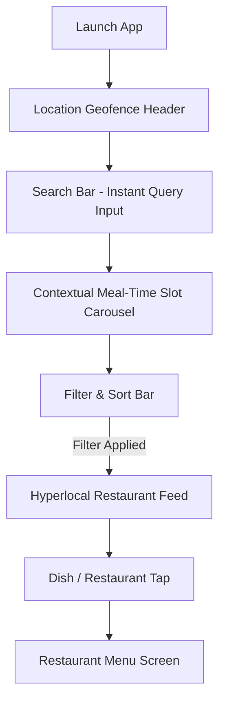
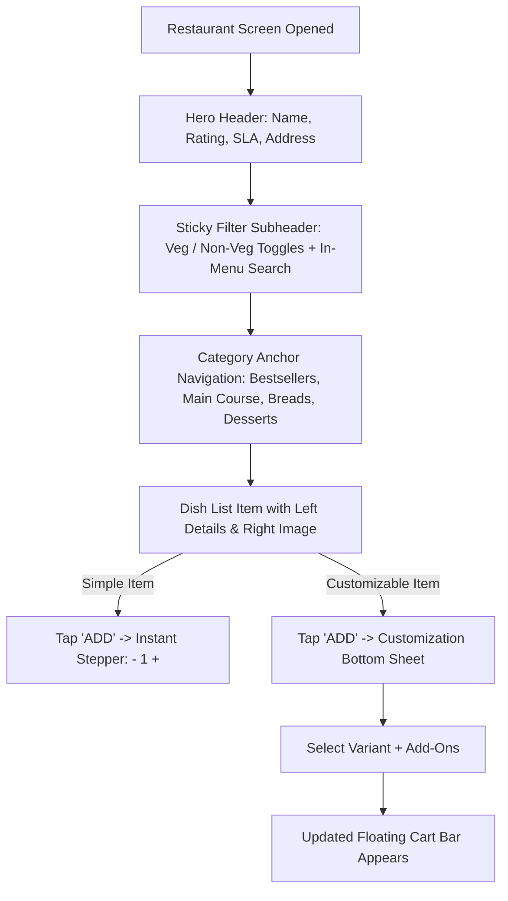
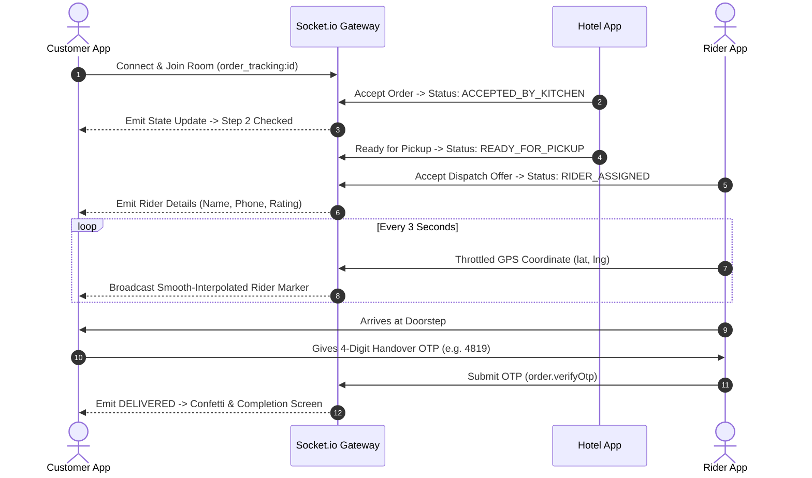

# Comprehensive UI Flow Comparison & Technical Audit Report: Swiggy vs. Zomato vs. Bocardo Monorepo

**Document Version:** 1.0.0  
**Target Architecture:** Bocardo Monorepo (`apps/customer`, `apps/hotel`, `apps/rider`, `apps/admin`)  
**Industry Benchmarks:** Swiggy (v14.x) & Zomato (v17.x)  
**Primary Focus:** UI Flow, Discovery, Filter Architecture, Dietary / Veg / Non-Veg Toggles, Cart, Checkout, and Post-Order Experience.

---

## Executive Summary

Modern Indian food delivery applications (dominated by Swiggy and Zomato) are hyper-optimized conversion funnels engineered around **speed, visual appetite appeal, dietary precision (crucial in the Indian culinary demographic), transparent hyper-local pricing, and real-time operational trust**.

This report delivers a deep comparative teardown of the user interface (UI) and user experience (UX) flows between **Swiggy**, **Zomato**, and the **Bocardo Monorepo**, dissecting:
1. **Dietary Architecture & Visual Signaling**: Veg / Non-Veg / Egg toggles, FSSAI regulatory compliance, and pure-veg filters.
2. **Hyperlocal Feed & Exploration Flow**: Location detection, contextual meal cravings, sorting, and multi-parameter filters.
3. **Menu Navigation & Customization Flow**: Category anchor tabs, sticky headers, in-menu search, portion variants, and add-on group steppers.
4. **Cart, Upselling & Indian Tax Transparency**: "Complete your meal" co-occurrence trays, tip chips, and Section 9(5) CGST dual-tax itemized bills.
5. **Post-Order Tracking & Anti-Fraud Handover**: Live map telemetry, multi-stage state machine stepper, and 4-digit doorstep delivery OTP.
6. **Partner Operations Flow**: Kitchen KOT 86-ing stock toggles, ghost restaurant timers, and rider 30s dispatch modals.

---

## 1. High-Level Design Philosophy & Visual Tokens

| Dimension | Swiggy | Zomato | Bocardo (Current) |
| :--- | :--- | :--- | :--- |
| **Primary Brand Token** | Saffron Orange (`#FC8019`) | Crimson Red (`#E23744` / `#CB202D`) | Signature Teal (`#0D9488` / `#0F766E`) |
| **Background / Neutral** | `#FFFFFF` & Clean Neutral Grey (`#F1F5F9`) | `#FFFFFF` with warm cream / slate tones | `#FFFFFF` & Slate (`#F8FAFC` / `#0F172A`) |
| **Typography & Tone** | Clean sans-serif, transaction-focused, high density | Expressive, bold food typography, lifestyle-centric | Modern system typography, geometric, high-contrast |
| **Dietary Visual Identity** | Strict FSSAI green circle & brown triangle badges | FSSAI badges + calorie / allergen & spicy tags | Custom drawn RN SVG/Views; green & red circles |
| **Floating Cart Pattern** | High-contrast bottom bar with count, subtotal & arrow | Floating pill bar with item count & view cart CTA | High-contrast teal floating bar with subtotal + tax note |

---

## 2. Dietary Architecture: Veg / Non-Veg Toggles & Indicators

Dietary classification is the single most critical filter in the Indian food ecosystem. Over 30% of Indian consumers strictly consume vegetarian food, while a large percentage observe intermittent vegetarian days (e.g., Tuesdays, Thursdays, Saturdays, or religious periods). Failing to isolate vegetarian from non-vegetarian food causes immediate basket abandonment.

### 2.1 Comparative Analysis Matrix

| Capability | Swiggy | Zomato | Bocardo (Current) |
| :--- | :--- | :--- | :--- |
| **Home Feed Filter** | Sticky horizontal filter pill: `Pure Veg` with green leaf icon. | Prominent top toggle `Veg Only` + `Pure Veg Fleet` mode. | ❌ **Missing on Home Feed**. Only meal-slot pills exist. |
| **Restaurant Menu Toggle** | Dual filter pills at top: `[🟢 Veg]` and `[🔴 Non-Veg]`. | Segmented pill toggle: `[🟢 Veg]` and `[🔴 Non-Veg]`. | Single basic RN `Switch` labeled "Veg Only". |
| **Egg Category Handling** | Dedicated yellow egg indicator badge; separate filter chip. | Yellow badge on egg items; separate filter chip. | `FoodType.EGG` in types; ❌ **No UI badge or filter**. |
| **FSSAI Visual Standards** | • Veg: Green square with green circular dot.<br>• Non-Veg: Brown square with brown filled triangle. | • Veg: Green square with green circular dot.<br>• Non-Veg: Brown/Red square with brown triangle. | • Veg: Green square with green circular dot.<br>• Non-Veg: Red square with red circular dot (❌ non-compliant). |
| **Pure Veg Fleet / Mode** | Available in select metros with dedicated green packaging tags. | Full green UI theme swap ("Pure Veg Mode") filtering only 100% veg kitchens. | ❌ Not currently implemented. |
| **Out-of-Stock Signaling** | Greyed out image, disabled ADD button with "Next available at...". | Greyed out card, "Currently Unavailable" overlay. | Hotel app has instant 86 toggle; customer menu shows basic list. |

### 2.2 Deep Dive: FSSAI Regulatory Geometric Standard

The Food Safety and Standards Authority of India (FSSAI) mandates specific shapes to protect color-blind individuals:
- **Vegetarian**: A green square perimeter containing a solid green circle centered inside.
- **Non-Vegetarian**: A brown square perimeter containing a solid brown equilateral triangle pointing upwards.
- **Egg**: A yellow/amber square perimeter containing an oval or circular yolk-colored symbol.

```
Swiggy / Zomato FSSAI Compliance:
  Veg:        [ 🟢 ]  (Green Border + Green Circle)
  Non-Veg:    [ ▲  ]  (Brown Border + Brown Upward Triangle)
  Egg:        [ 🟡 ]  (Yellow Border + Yellow Oval/Circle)

Bocardo Current State (apps/customer/src/app/restaurant/[id].tsx):
  Veg:        [ 🟢 ]  (Green Border #16A34A + Green Circle)
  Non-Veg:    [ 🔴 ]  (Dark Red Border #991B1B + Red Circle)  <-- Shape Violation!
```

> [!WARNING]
> In `apps/customer/src/app/restaurant/[id].tsx`, Bocardo renders a red circle inside a red square for non-veg items. Because 8% of male users suffer from red-green color blindness (deuteranopia/protanopia), they cannot distinguish between the green circle and red circle without the geometric triangle indicator.

---

## 3. End-to-End Customer Screen Flow Comparison

### 3.1 Screen 1: Discovery & Hyperlocal Home Feed (`/`)



#### Comparison:
1. **Location Header**:
   - **Swiggy/Zomato**: Shows active address label (e.g. "Home", "Work", "Indiranagar 100ft Rd"), full street address below, and chevron linking to the Google Places / PostGIS address sheet.
   - **Bocardo**: Matches this pattern cleanly with `Indiranagar 100ft Rd`, Bengaluru subtitle, and profile avatar chip.
2. **Contextual Meal-Time Slots**:
   - **Swiggy**: Dynamic hero carousel adapting to time of day: "Breakfast Cravings" (7-11 AM), "Lunch Thali & Biryani" (11 AM-4 PM), "Evening Snacks & Chai" (4-7 PM), "Late Night Munchies" (11 PM-5 AM).
   - **Zomato**: Visual round category chips ("Biryani", "Pizza", "North Indian", "Healthy").
   - **Bocardo**: Implements a horizontal pill carousel with active teal styling for `BREAKFAST`, `LUNCH`, `SNACKS`, `DINNER`, and `LATE_NIGHT`.
3. **Filter & Sort Bar**:
   - **Swiggy/Zomato**: Sticky horizontal scroller containing:
     - `Sort by` (Relevance, Delivery Time, Rating, Cost)
     - `Fast Delivery` (<30 mins)
     - `Pure Veg` (One-tap green filter)
     - `Rating 4.0+`
     - `Offers` (Flat ₹100 off, BOGO)
     - `Cuisines` (Multi-select sheet)
   - **Bocardo (Current Gap)**: **No filter bar on the home feed**. The user cannot filter for pure-veg restaurants, rating thresholds, or fast delivery without opening individual restaurants.

---

### 3.2 Screen 2: Restaurant Menu & Dish Selection (`/restaurant/[id]`)



#### Detailed Comparison:

#### A. Category Anchor Navigation:
- **Swiggy**: Horizontal category tab bar that pins to the top upon scrolling (Sticky Category Bar) + floating round FAB button in the bottom right (`Browse Menu • 8 Categories`) which opens a modal drawer with dish counts.
- **Zomato**: Expandable accordion headers per category ("Recommended (12)", "Biryani (8)") with sticky title pinning.
- **Bocardo (Current Gap)**: The dishes are displayed in a flat list without category headers, anchor jumping, or category pill navigation.

#### B. Veg / Non-Veg Filtering in Menu:
- **Swiggy**: Prominent dual toggle buttons:
  - `[🟢 Veg]` (Tapping filters out all non-veg and egg dishes).
  - `[🔴 Non-Veg]` (Tapping filters out all pure veg dishes).
  - `[Bestseller]` pill.
- **Zomato**: Segmented switch with animated green/red sliding pill selector.
- **Bocardo**: Single React Native `Switch` labeled "Veg Only".

#### C. Menu Customization & Add-On Flow:
- **Swiggy & Zomato**:
  - If a dish has variants or add-ons, the button displays `ADD +` with a small `customisable` subscript.
  - Tapping opens a sleek bottom sheet containing:
    1. **Size / Portion Variant** (Radio group: Half ₹220, Full ₹380 - Mandatory 1).
    2. **Mandatory Choices** (e.g. "Choose your bread - Select 1").
    3. **Optional Add-Ons** (Checkboxes with quantity steppers: Extra Cheese +₹40, Garlic Dip +₹25).
    4. Real-time dynamic total button at bottom (`Add Item • ₹320`).
    5. **"Repeat Last" Dialog**: If the customer taps `+` on an already customized item, Swiggy/Zomato show a bottom dialog: *"Repeat last used customization?"* with two buttons: `Repeat Last` vs `Choose New`.
- **Bocardo (Current Gap)**:
  - The database schema and shared-types library (`packages/shared-types/src/menu.ts`) have complete support for `DishVariantSchema`, `AddOnGroupSchema`, `priceCustomization()`, and `buildCartLineId()`.
  - However, in `apps/customer/src/app/restaurant/[id].tsx`, tapping `ADD` immediately pushes a flat item to `cartStore` without rendering a customization sheet or checking mandatory add-on groups.

---

### 3.3 Screen 3: Cart, Upselling & Transparent Indian Checkout (`/cart`)

```mermaid
flowchart TD
    A[Tap Floating Cart] --> B[Cart Screen Loaded]
    B --> C[Restaurant Header & Delivery Destination]
    C --> D[Itemized Dish List with Steppers]
    D --> E[Co-Occurrence Upsell Tray: 'Complete Your Meal']
    E --> F[Delivery Partner Tip Chips: ₹20, ₹30, ₹50]
    F --> G[Cooking & Delivery Notes Input]
    G --> H[Section 9(5) CGST Dual-Tax Bill Breakdown]
    H --> I[Proceed to Pay -> Razorpay Modal]
```

#### Detailed Comparison:

#### A. Co-occurrence Upsell ("Complete Your Meal"):
- **Swiggy**: Slide-up tray or horizontal cards recommending high-margin complementary dishes (e.g., if Biryani in cart, suggests Burani Raita, Salan, Gulab Jamun, Thums Up).
- **Zomato**: "People also ordered" horizontal scroller right beneath the item list.
- **Bocardo**: Implements a "Complete Your Meal ✨" card using `dish_pair_associations` to suggest accompaniments with a 1-tap `+ ADD` button.

#### B. Delivery Partner Tip:
- **Swiggy & Zomato**: Tip chips (₹20, ₹30, ₹50, Most Tipped) with visual badges stating *"100% goes to your delivery partner"*.
- **Bocardo**: Accurately implements interactive tip chips (`₹20`, `₹30`, `₹50`) updating the grand total live.

#### C. Indian Tax Transparency & Section 9(5) CGST Bill Breakdown:
Under Indian GST Law (effective Jan 1, 2022 under Section 9(5) of the CGST Act), food delivery platforms must pay 5% GST on behalf of restaurants, separate from the 18% GST charged on platform convenience fees.

| Bill Line Item | Swiggy Display | Zomato Display | Bocardo Implementation |
| :--- | :--- | :--- | :--- |
| **Food Subtotal** | "Item Total" | "Item Total" | `totals.subtotalPaise` |
| **Food GST (5%)** | Included in expandable "Taxes & charges" modal | Hidden under "Taxes and charges" chevron | **Explicit line item:** `Restaurant GST (5% Sec 9(5))` |
| **Delivery Fee** | Free on Swiggy One / ₹35-60 tiered | Free on Zomato Gold / ₹35-65 tiered | Fixed delivery fee (`₹40`) |
| **Platform Fee** | ₹5.00 to ₹7.50 | ₹5.00 to ₹8.00 | Fixed platform fee (`₹5.00`) |
| **Service GST (18%)** | Combined inside taxes sheet | Combined inside taxes sheet | **Explicit line item:** `Service GST (18% on convenience)` |
| **Delivery Tip** | Displayed when selected | Displayed when selected | Displayed dynamically when `tipPaise > 0` |
| **Grand Total** | Bold bottom checkout button | Bold bottom checkout button | High-contrast bottom bar with "Proceed to Pay →" |

> [!NOTE]
> Bocardo's dual-tax disclosure is actually **more transparent** than Swiggy or Zomato, as both commercial apps hide the 5% vs 18% breakdown behind a collapsed accordion to minimize checkout friction, whereas Bocardo displays both line items clearly to prevent customer disputes.

---

### 3.4 Screen 4: Live Order Tracking & Handover OTP (`/orders/[id]`)



#### Detailed Comparison:
1. **Multi-Stage Order Stepper**:
   - **Swiggy/Zomato**: Visual timeline with animated illustrations (Chef cooking, bike moving along route).
   - **Bocardo**: Clean vertical stepper tracking: `Order Confirmed` → `Kitchen Accepted` → `Preparing Fresh Food` → `Rider Out for Delivery` → `Delivered`.
2. **Delivery Handover OTP**:
   - **Swiggy / Zomato**: Both apps introduced mandatory 4-digit PINs / OTPs for high-value orders and cash-on-delivery to eliminate "rider marked delivered without handing over food" fraud.
   - **Bocardo**: Features a dedicated, high-visibility amber OTP card with 4 discrete numeric boxes:
     ```
     🛡️ Delivery Handover OTP: [ 4 ] [ 8 ] [ 1 ] [ 9 ]
     ⚠️ Share with rider ONLY when at your doorstep.
     ```
3. **Live GPS Map**:
   - **Swiggy/Zomato**: Mapbox / Google Maps SDK with custom SVG scooter markers rotating according to heading bearing.
   - **Bocardo**: Real-time Socket.io listener updating coordinates every 3 seconds with a pulsing teal radar ring.

---

## 4. Kitchen & Rider Operations UI Flow Comparison

### 4.1 Hotel / Kitchen Partner App (`apps/hotel`)

| Feature | Swiggy Partner App | Zomato Restaurant Partner | Bocardo Hotel App |
| :--- | :--- | :--- | :--- |
| **Incoming Order Alert** | Piercing siren audio looping continuously; volume forced to max. | Loud sound ring; screen flashes red/amber. | Looping alarm (`STREAM_ALARM` channel) terminating only on tap. |
| **Ghost Order Timeout** | 120-second countdown ring; auto-rejects order on timeout. | 120-second countdown; auto-rejects & penalties applied. | 120s countdown ring + BullMQ worker triggering instant auto-refund. |
| **Item 86-ing (Stock Out)**| Toggle dish out-of-stock for: Next 2 hours, rest of day, or indefinitely. | "Turn Off Item" toggle with duration picker. | One-tap switch per dish in `apps/hotel/src/app/menu.tsx` with instant visual state (`IN STOCK` vs `86-ED`). |
| **KOT Thermal Printing** | Direct ESC/POS Bluetooth & LAN printer support with retry queue. | ESC/POS USB / Bluetooth print queue with reprint button. | ESC/POS thermal formatting with local SQLite fallback buffer (`printer.ts`). |

### 4.2 Delivery Rider App (`apps/rider`)

| Feature | Swiggy Delivery Partner | Zomato Delivery Partner | Bocardo Rider App |
| :--- | :--- | :--- | :--- |
| **Duty Toggle** | Large switch at top: "You are Offline / Online". | "Go Online" slider with selfie / helmet verification. | Prominent duty status toggle. |
| **Dispatch Assignment** | Full-screen modal with 30-second countdown bar and payout display. | Full-screen overlay with 30s countdown and chime. | Full-screen modal with circular countdown, payout in ₹, and decline cascade. |
| **Geofenced Arrival** | "Arrived at Restaurant" disabled if GPS distance > 100m. | Geofence verification before arrival button enables. | PostGIS/Turf distance check rejecting taps beyond 100m radius. |
| **Handover Verification** | Delivery partner must enter customer's 4-digit code. | OTP dialog prompt at doorstep. | OTP input modal enforcing exact 4-digit match against database before allowing `DELIVERED`. |

---

## 5. Comprehensive Feature-by-Feature Gap Analysis Matrix

The table below catalogs every key UI flow across Swiggy, Zomato, and the current Bocardo codebase, detailing the gap severity and the exact code modification required:

| UI Flow / Component | Swiggy | Zomato | Bocardo (Current) | Gap Severity | Proposed Action |
| :--- | :--- | :--- | :--- | :--- | :--- |
| **Home: Pure Veg Filter** | Top horizontal filter pill | Top pill + pure veg mode toggle | ❌ Not present on Home | 🔴 **High** | Add sticky horizontal filter bar to `apps/customer/src/app/index.tsx` with `Pure Veg` chip. |
| **Home: Rating & SLA Filters** | `Rating 4.0+`, `Fast Delivery` pills | `Rating 4.0+`, `<30 Mins` pills | ❌ Not present on Home | 🟡 **Medium** | Implement multi-select filter row that filters `DEMO_RESTAURANTS` or tRPC queries. |
| **FSSAI Non-Veg Badge** | Brown square + brown triangle | Brown square + brown triangle | Red square + red circle | 🔴 **High** | Update `apps/customer/src/app/restaurant/[id].tsx` to render an SVG/triangle for non-veg items. |
| **Menu: Category Anchor Nav** | Sticky category pills + floating FAB | Accordion headers + sticky bar | Flat vertical list | 🔴 **High** | Group dishes by `category` and render sticky horizontal category navigation chips. |
| **Menu: Dual Veg / Non-Veg Toggles** | `[🟢 Veg]` and `[🔴 Non-Veg]` pills | `[🟢 Veg]` and `[🔴 Non-Veg]` pills | Single RN `Switch` ("Veg Only") | 🟡 **Medium** | Replace `Switch` with dual-segment filter chips: `All`, `Veg Only`, `Non-Veg Only`. |
| **Menu: Item Customization Sheet**| Bottom sheet for variants & add-ons | Bottom sheet with steppers | Instant 1-tap add to cart | 🔴 **High** | Connect `packages/shared-types/src/menu.ts` to a React Native bottom sheet modal on dish tap. |
| **Menu: In-Menu Search** | Search icon in restaurant header | Search bar inside restaurant page | ❌ Not present in menu | 🟡 **Medium** | Add debounced in-menu search input filtering restaurant dishes. |
| **Cart: Repeat Customization** | "Repeat Last" vs "Customize New" | "Repeat Last" prompt | Replaces quantity with +1 | 🟢 **Low** | Store customization hash and prompt user if item has variants. |
| **Tracking: Driver Call Masking**| In-app VoIP or Exotel virtual number | In-app call masking | Demo static phone trigger | 🟢 **Low** | Masked phone display (`+91 98*** **210`). |

---

## 6. Architectural Code Blueprints for Bocardo UI Upgrades

To bridge the gaps identified above, here are the production-ready component blueprints tailored for Bocardo's React Native (Expo) architecture:

### 6.1 FSSAI-Compliant Veg / Non-Veg / Egg Badge Component (`VegNonVegBadgeRN.tsx`)

```tsx
import React from 'react';
import { View, StyleSheet } from 'react-native';
import { FoodType } from '@bocardo/shared-types';

interface Props {
  foodType: FoodType | 'VEG' | 'NON_VEG' | 'EGG';
  size?: number;
}

export const VegNonVegBadgeRN: React.FC<Props> = ({ foodType, size = 14 }) => {
  const isVeg = foodType === FoodType.VEG || foodType === 'VEG';
  const isNonVeg = foodType === FoodType.NON_VEG || foodType === 'NON_VEG';
  const isEgg = foodType === FoodType.EGG || foodType === 'EGG';

  const borderColor = isVeg ? '#16A34A' : isEgg ? '#D97706' : '#7F1D1D';

  return (
    <View style={[styles.outerSquare, { width: size, height: size, borderColor }]}>
      {isVeg && <View style={[styles.vegDot, { width: size * 0.45, height: size * 0.45 }]} />}
      {isEgg && <View style={[styles.eggDot, { width: size * 0.45, height: size * 0.55 }]} />}
      {isNonVeg && (
        <View
          style={[
            styles.nonVegTriangle,
            {
              borderLeftWidth: size * 0.28,
              borderRightWidth: size * 0.28,
              borderBottomWidth: size * 0.5,
            },
          ]}
        />
      )}
    </View>
  );
};

const styles = StyleSheet.create({
  outerSquare: {
    borderWidth: 1.5,
    borderRadius: 3,
    backgroundColor: '#FFFFFF',
    alignItems: 'center',
    justifyContent: 'center',
  },
  vegDot: {
    borderRadius: 99,
    backgroundColor: '#16A34A',
  },
  eggDot: {
    borderRadius: 99,
    backgroundColor: '#D97706',
  },
  nonVegTriangle: {
    width: 0,
    height: 0,
    backgroundColor: 'transparent',
    borderStyle: 'solid',
    borderLeftColor: 'transparent',
    borderRightColor: 'transparent',
    borderBottomColor: '#7F1D1D',
  },
});
```

---

### 6.2 Dual Veg / Non-Veg Segmented Filter Bar (`DietaryFilterBar.tsx`)

```tsx
import React from 'react';
import { View, Text, TouchableOpacity, StyleSheet } from 'react-native';

export type DietaryFilterOption = 'ALL' | 'VEG_ONLY' | 'NON_VEG_ONLY';

interface Props {
  selected: DietaryFilterOption;
  onChange: (option: DietaryFilterOption) => void;
}

export const DietaryFilterBar: React.FC<Props> = ({ selected, onChange }) => {
  return (
    <View style={styles.container}>
      <TouchableOpacity
        style={[styles.pill, selected === 'VEG_ONLY' && styles.vegActive]}
        onPress={() => onChange(selected === 'VEG_ONLY' ? 'ALL' : 'VEG_ONLY')}
      >
        <View style={styles.vegIcon} />
        <Text style={[styles.label, selected === 'VEG_ONLY' && styles.vegLabelActive]}>
          Veg
        </Text>
      </TouchableOpacity>

      <TouchableOpacity
        style={[styles.pill, selected === 'NON_VEG_ONLY' && styles.nonVegActive]}
        onPress={() => onChange(selected === 'NON_VEG_ONLY' ? 'ALL' : 'NON_VEG_ONLY')}
      >
        <View style={styles.nonVegIcon} />
        <Text style={[styles.label, selected === 'NON_VEG_ONLY' && styles.nonVegLabelActive]}>
          Non-Veg
        </Text>
      </TouchableOpacity>
    </View>
  );
};

const styles = StyleSheet.create({
  container: { flexDirection: 'row', gap: 8, paddingVertical: 8 },
  pill: {
    flexDirection: 'row',
    alignItems: 'center',
    paddingHorizontal: 10,
    paddingVertical: 6,
    borderRadius: 18,
    borderWidth: 1,
    borderColor: '#E2E8F0',
    backgroundColor: '#FFFFFF',
    gap: 6,
  },
  vegActive: { borderColor: '#16A34A', backgroundColor: '#F0FDF4' },
  nonVegActive: { borderColor: '#DC2626', backgroundColor: '#FEF2F2' },
  vegIcon: { width: 8, height: 8, borderRadius: 4, backgroundColor: '#16A34A' },
  nonVegIcon: { width: 8, height: 8, backgroundColor: '#DC2626', transform: [{ rotate: '45deg' }] },
  label: { fontSize: 12, fontWeight: '700', color: '#475569' },
  vegLabelActive: { color: '#15803D' },
  nonVegLabelActive: { color: '#B91C1C' },
});
```

---

### 6.3 Category Anchor Navigation Bar (`CategoryAnchorNav.tsx`)

```tsx
import React from 'react';
import { ScrollView, TouchableOpacity, Text, StyleSheet } from 'react-native';

interface Props {
  categories: string[];
  activeCategory: string;
  onSelectCategory: (category: string) => void;
}

export const CategoryAnchorNav: React.FC<Props> = ({
  categories,
  activeCategory,
  onSelectCategory,
}) => {
  return (
    <ScrollView horizontal showsHorizontalScrollIndicator={false} style={styles.container}>
      {categories.map((cat) => {
        const isActive = activeCategory === cat;
        return (
          <TouchableOpacity
            key={cat}
            onPress={() => onSelectCategory(cat)}
            style={[styles.tab, isActive && styles.tabActive]}
          >
            <Text style={[styles.text, isActive && styles.textActive]}>{cat}</Text>
          </TouchableOpacity>
        );
      })}
    </ScrollView>
  );
};

const styles = StyleSheet.create({
  container: { backgroundColor: '#FFFFFF', paddingHorizontal: 16, borderBottomWidth: 1, borderBottomColor: '#F1F5F9' },
  tab: { paddingVertical: 12, paddingHorizontal: 14, marginRight: 6, borderBottomWidth: 2, borderBottomColor: 'transparent' },
  tabActive: { borderBottomColor: '#0D9488' },
  text: { fontSize: 13, fontWeight: '600', color: '#64748B' },
  textActive: { color: '#0D9488', fontWeight: '800' },
});
```

---

## 7. Recommended Implementation Sequence for Bocardo

To bring the Bocardo platform to full parity with Swiggy and Zomato tier-1 standards, implement the following prioritized roadmap:

1. **Sprint 1: Dietary Fidelity & FSSAI Geometric Standards**
   - Replace the red-circle icon in `apps/customer/src/app/restaurant/[id].tsx` with the FSSAI standard upward triangle.
   - Replace the single "Veg Only" switch with dual segmented buttons: `[🟢 Veg]` and `[🔴 Non-Veg]`.
   - Add the `Pure Veg` filter chip to the home feed (`apps/customer/src/app/index.tsx`).

2. **Sprint 2: Menu Category Navigation & Customization Modal**
   - Group dishes by category (`Bestsellers`, `Biryani`, `Accompaniments`, `Desserts`) in the restaurant screen.
   - Render a sticky horizontal category navigation bar with scroll-spy synchronization.
   - Build the `CustomizationBottomSheet` modal using `packages/shared-types/src/menu.ts` validation schemas (`DishVariantSchema` and `AddOnGroupSchema`).

3. **Sprint 3: Home Feed Search & Filter Suite**
   - Add debounced instant search with dish suggestions and cuisine chips.
   - Add quick filter chips (`Rating 4.0+`, `Fast Delivery (<30 mins)`, `Cost: Low to High`).

4. **Sprint 4: Operations & Post-Order Polish**
   - Enhance the rider live tracking map with smooth polyline route rendering between the restaurant and customer location.
   - Add a "Reprint KOT" action in the Hotel partner app if an ESC/POS printer queue encounters a paper jam.
